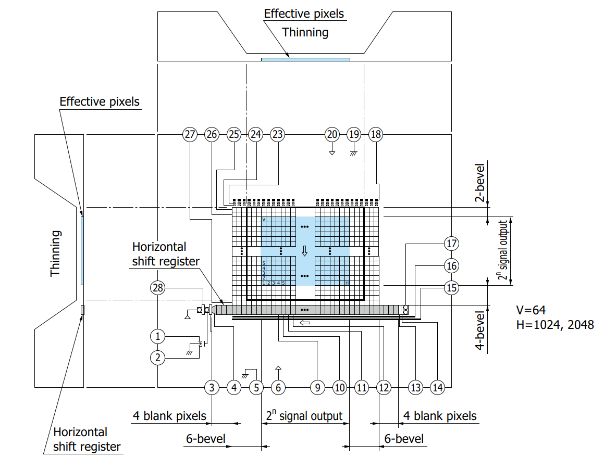
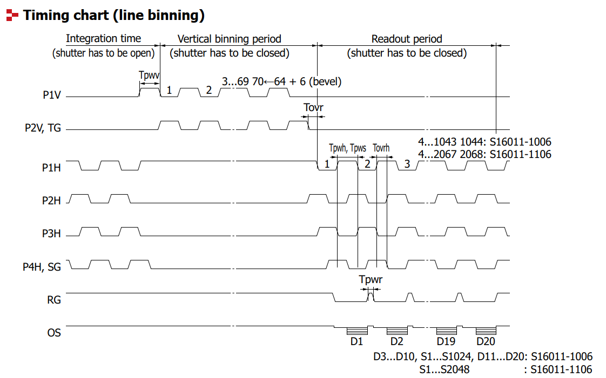
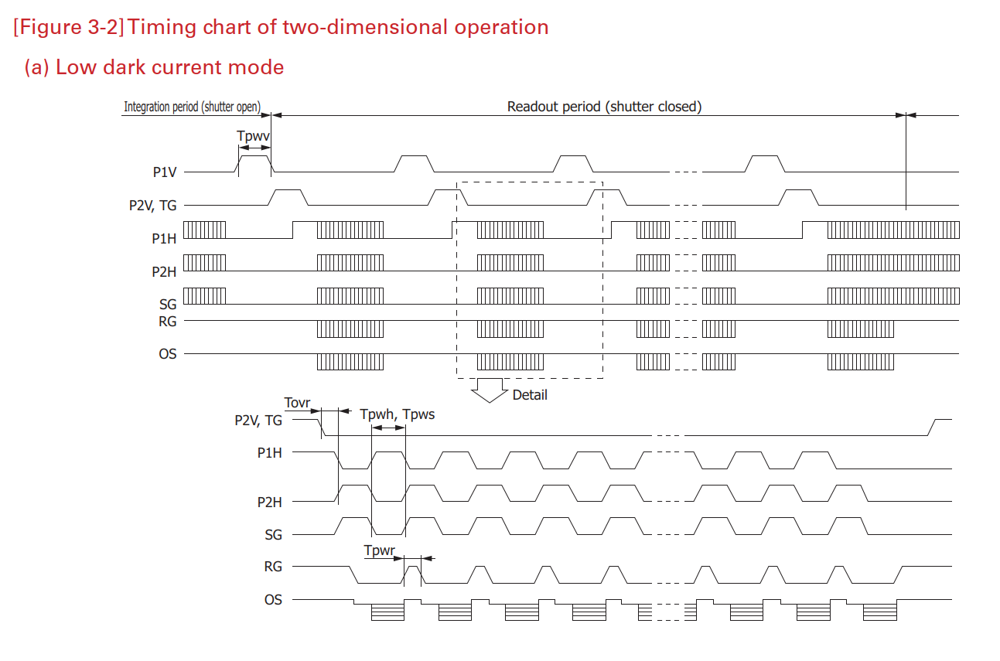
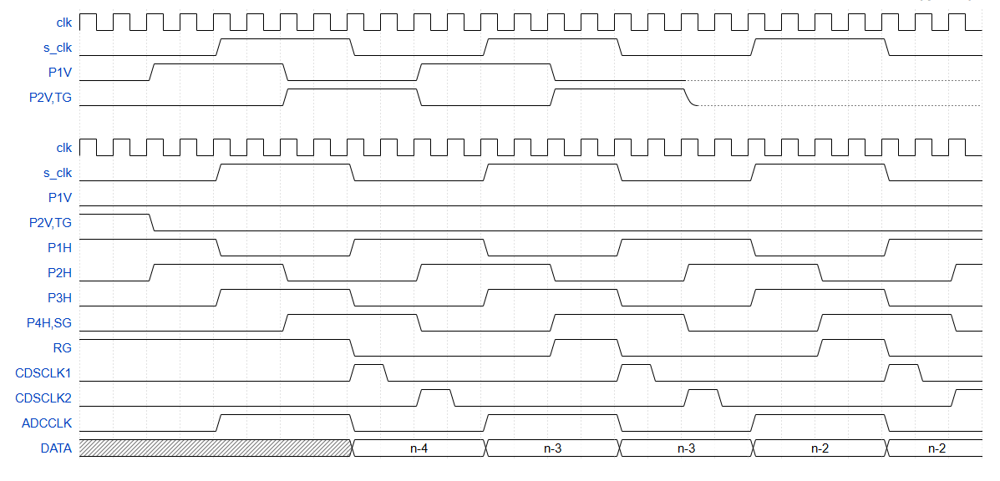
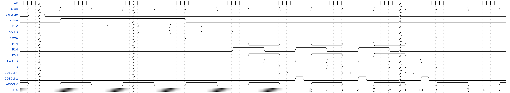
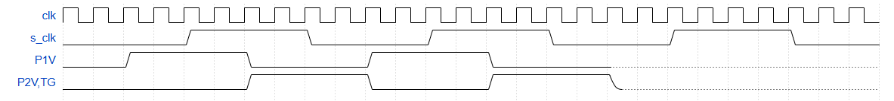
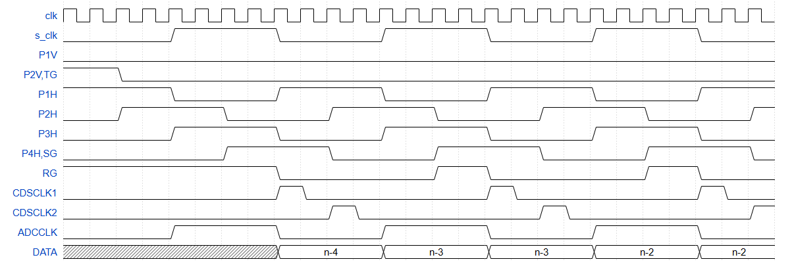
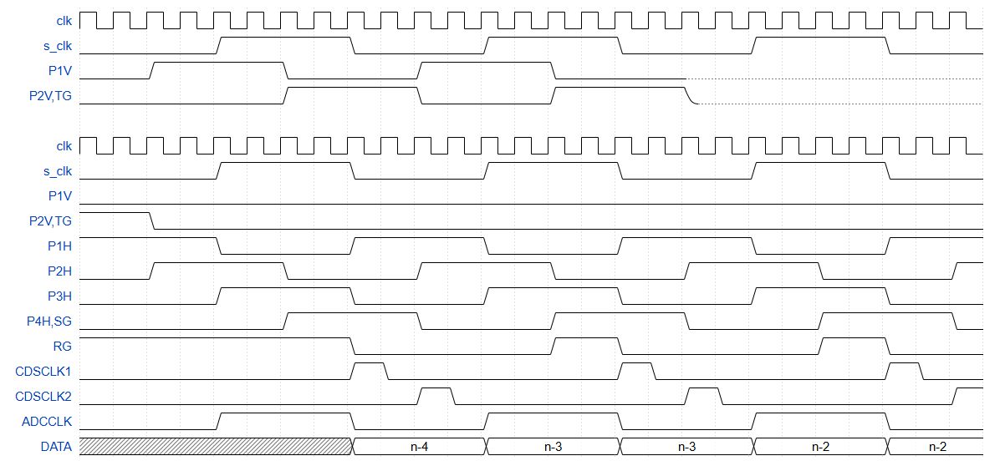

只管 CCD 的移位时序产生、数据缓存、数据发送，曝光时间由其它控制（比如计时器）。

时序逻辑：接收一个曝光信号，当曝光信号为低时，开始对像素进行移位读出。同时控制 ADC 对读出的模拟信号进行采样，解析输出数据，去掉bevel像素，保留暗像素和感光像素信号，数据存在 ram 中。完成一帧数据读取后，即进入复位状态，等待下一个曝光信号下降沿。

## 时序

包括垂直移位、水平移位、ad9826 时序

### 状态机

- 复位在 idle

  

状态定义

该状态机有三个主要状态，每个状态代表系统的一个特定操作模式：

- **`idle` (空闲)**: 这是系统的初始或等待状态。系统在此状态下不执行主要的移位操作，并等待一个触发信号来开始工作。
- **`vertical shift` (垂直移位)**: 当系统被激活后，会进入此状态。它负责执行垂直方向上的调整或移动。
- **`horizontal shift` (水平移位)**: 在垂直移位完成后，系统进入此状态，负责执行水平方向上的调整或移动。

系统根据预设的条件在这些状态之间进行切换。箭头的方向和旁边的标签清晰地定义了这些转换规则：

1. **从 `idle` 到 `vertical shift`**
   - **触发条件**: `exposure下降沿`
   - **描述**: 当系统处于 `idle` 状态时，如果检测到 `exposure`（曝光）的下降沿，系统将启动并转移到 `vertical shift` 状态。这通常是整个操作流程的开始。
   - **复位电平**: exposure 下降沿检测的同步链（`exp_sync`/`exp_sync_d1`）复位为 `0`（与 exposure 静止电平一致）——复位释放时若 exposure=0 不会产生假下降沿（避免误触发一帧读出）；若 exposure=1，链先跟踪高电平，再由真实 1→0 触发读出。
2. **从 `vertical shift` 到 `horizontal shift`**
   - **触发条件**: `v_counter = v - 1`
   - **描述**: 在 `vertical shift` 状态下，系统会持续进行垂直移位操作。当一个名为 `v_counter` 的垂直计数器达到其目标值（即 `v - 1`）时，表示垂直移位完成，系统将自动切换到 `horizontal shift` 状态。
3. **从 `horizontal shift` 返回 `vertical shift`**
   - **触发条件**: `h_counter` 计满一行水平移位 **且** `l_counter ≠ l`
   - **描述**: 在 `horizontal shift` 状态下，如果水平计数器 `h_counter` 计满一行（水平移位完成），但 `l_counter` 尚未达到总行数，系统会返回到 `vertical shift` 状态进行下一行的垂直移位，形成行循环。
4. **从 `horizontal shift` 返回 `idle`**
   - **触发条件**: `h_counter` 计满一行水平移位 **且** `l_counter = l`
   - **描述**: 同样在 `horizontal shift` 状态下，如果水平计数器 `h_counter` 计满一行，**并且**此时 `l_counter` 已达到总行数，表示整帧读出完成，系统返回 `idle` 状态等待下一次曝光。
5. **`idle` 状态的自循环**
   - **触发条件**: `reset`
   - **描述**: 无论系统因何种原因处于 `idle` 状态，一个 `reset`（复位）信号都可以使其保持在 `idle` 状态。这通常用于确保系统在开始前或出现异常时能被可靠地重置到已知的初始状态
6. 状态变化与 s_clk 上升沿同步
  - v_counter 与 s_clk 上升沿同步，当 vstate = 1 时计数；复位值为 0
  - h_counter 与 s_clk 上升沿同步，当 hstate = 1 时计数；复位值为 0
  - l_counter 与 s_clk 上升沿同步，h_counter 计满一行水平移位时递增；IDLE 时复位为 0

> 注：上述状态转移及 l_counter 递增条件中涉及的偏移量（如 `+4`、`+2` 等）为初步建议值，可在仿真中微调时序以适配实际 CCD 驱动需求。

| 读出类型     | 变量 v                               | 变量 h                                                       | 变量 l                                           |
| ------------ | ------------------------------------ | ------------------------------------------------------------ | ------------------------------------------------ |
| line binning | bevel_top+image_height+bevel_botttom | blank_left+bevel_left+ image_width+ bevel_right+blank_right | 1                                                |
| image        | 1                                    | blank_left+bevel_left+ image_width+ bevel_right+blank_right | bevel_top+ image_height+ bevel_botttom |

S16011 各参数值

- bevel_left, bevel_top, bevel_right, bevel_bottom: 6, 2, 6, 4
- blank_left, blank_right: 4, 4
- image_width: 1024/2048
- image_height: 64

### 垂直移位时序

- 当处于“垂直移位”状态时，输出 P1V,P2V(TG) 使能信号，再通过使能信号进一步控制垂直移位时钟输出。P1V 和 P2V 使能信号同步边沿不一样
- p1v 等信号的使能，只依赖于 v_counter 的值，并不与 vstate,hstate 严格对齐

| 使能信号 | 使能条件（初步建议值）            | 同步边沿     |
| -------- | -------------------------------- | ------------ |
| P1V      | v_counter 在有效范围内 (如 >0)   | s_clk 下降沿 |
| P2V,TG   | v_counter 在有效范围内 (如 >0)   | s_clk 上升沿 |

### 水平移位和ADC时序

- CDSCLK1,2 采样信号复位状态：低
- 当处于”水平移位"状态时，输出水平移位时钟使能信号，再通过使能信号控制水平移位时钟信号的输出
- 当 RG 下降沿到来，CDSCLK1 拉高，持续1个时钟周期
- 当 P4H 下降沿到来，CDSCLK2 拉高，持续1个时钟周期
- CDSCLK1,2 都需要经过一个延时器输出，方便调节采样时间点。默认采样点可能不太适合，需要适当延时 100-1000ns，但不能超过一个时钟周期。
- h_counter 在 ADCCLK 上升沿计数
- p1h 等信号的使号，只依赖于 h_counter 的值，并不与 vstate,hstate 严格对齐

> 注：下表中使能条件的比较边界为初步建议值，可在仿真中微调以确保信号对齐。

| 使能信号 | 使能条件（初步建议值）           | 同步边沿     |
| -------- | ------------------------------- | ------------ |
| P1H      | h_counter 在有效范围内 (如 >0)   | s_clk 下降沿 |
| P2H      | h_counter 在有效范围内 (如 >0)   | s_clk 下降沿 |
| P3H      | h_counter 在有效范围内 (如 >0)   | s_clk 下降沿 |
| P4H,SG   | h_counter 在有效范围内 (如 >0)   | s_clk 上升沿 |
| RG       | h_counter 在有效范围内 (如 >0)   | s_clk 上升沿 |

### 时钟信号

P1V,P2V,P1H,P2H,P3H,P4H,ADCCLK 频率相等，但相位不同。

| 信号    | 复位电平 | 相位        | 占空比 |
| ------- | -------- | ----------- | ------ |
| ADCCLK  | 0        | 0度         | 50%    |
| P1V     | 0        | 落后 270 度 | 50%    |
| P2V(TG) | 0        | 落后 90 度  | 50%    |
| P1H     | 1        | 落后 180 度 | 50%    |
| P2H     | 0        | 落后 270 度 | 50%    |
| P3H     | 0        | 0 度        | 50%    |
| P4H(SG) | 0        | 落后 90 度  | 50%    |
| RG      | 1        | 落后 90 度  | 25%    |
| CDSCLK1 | 0        | 落后 180 度 | 12.5%  |
| CDSCLK2 | 0        | 落后 270 度 | 12.5%  |

同相信号：

- s_clk 和 ADCCLK, P3H

- P1V 和 P2H
- P2V 和 P4H，RG

s_clk(ADCCLK) 频率就是 CCD 的读出时钟频率，不能超过 500kHz

## 像素数据输出

| Port          | Bit  | Description                                                  |
| ------------- | ---- | ------------------------------------------------------------ |
| data_valid    | 1    | 高电平表示当前 ADCCLK 串出的像素数据有效；与 sclk_p180_w  上升沿同步 |
| pixel_type    | 2    | 区分不同像素数据类型；与 sclk_p180_w  上升沿同步 2'b00: bevel pixel 2'b01: blank pixel 2'b10: active pixel |
| o_pixel_data  | 16   | 将 ADC 输出的 8 位数据拼成 16 位；与 sclk_p270_w 上升沿同步  |
| o_frame_start | 1    | 帧开始                                                       |
| o_frame_end   | 1    | 帧结束                                                       |
| o_frame_idle  | 1    | 帧数据串出                                                   |

- 当 o_frame_start 触发后，
  - 当 o_frame_end 和 o_frame_idle 同为高，意味着帧传送完毕。
  - 如果中途 o_frame_idle 拉高，意味着帧异常。

当 h_counter > 5，不同像素数据开始输出，顺序是：

1. blank 像素，数目为 blank_left 
2. bevel 像素，数目为 bevel_left
3. active 像素，数目为 image_width
4. bevel 像素，数目为 bevel_right
5. blank 像素，数目为 blank_right

