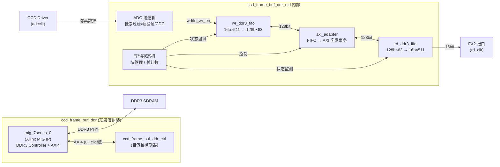
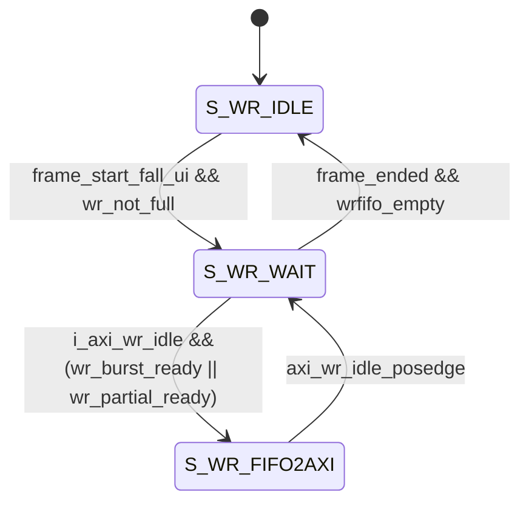
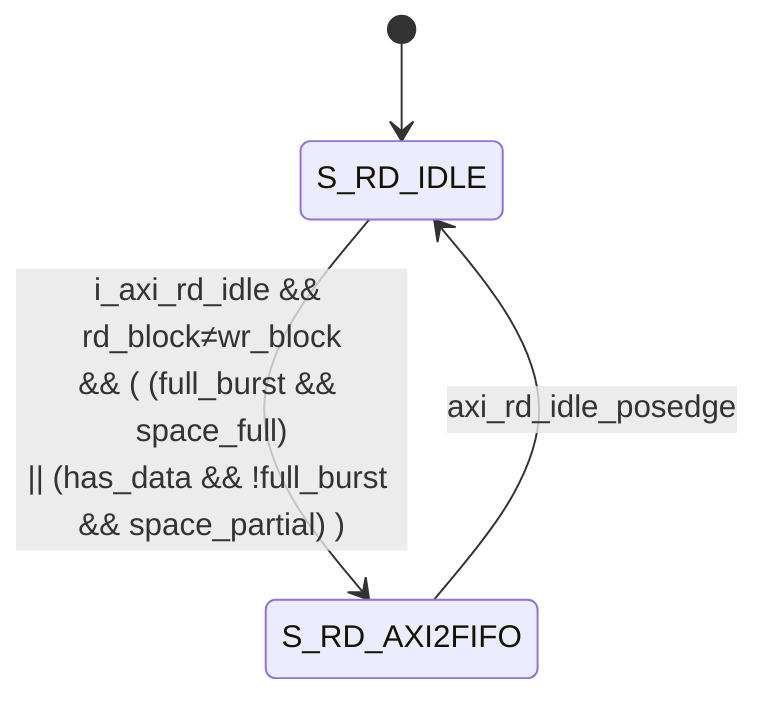
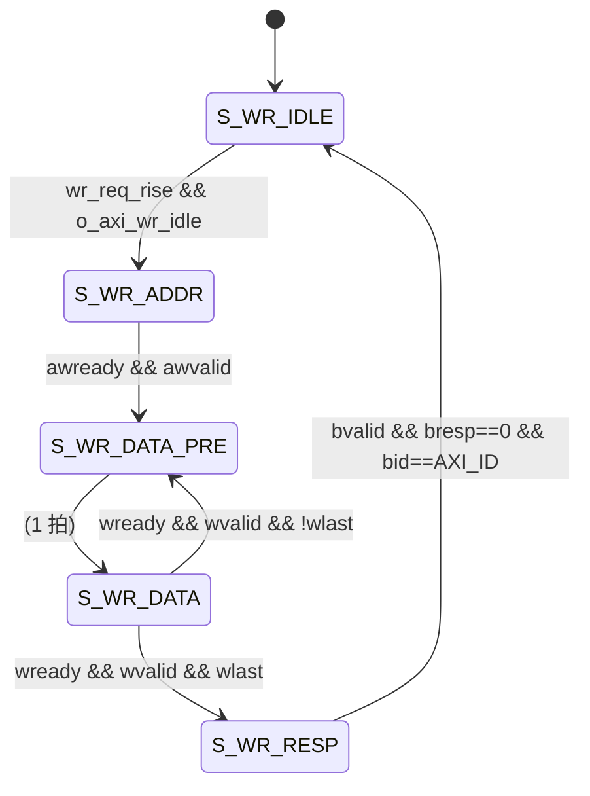
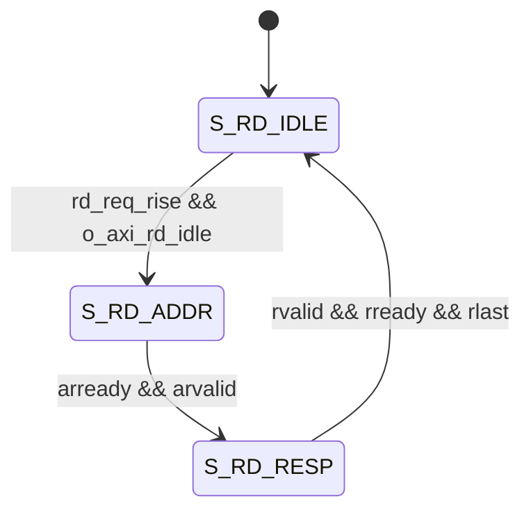

# 帧缓存模块 — DDR 实现

## 使用说明

- **固定帧长度**：帧长度（`i_read_mode=0` 时为 `width`，`=1` 时为 `width × height`）在**复位释放后锁定一次**，下次复位前所有帧使用相同长度——无需 per-frame depth 机制，寄存器开销与 `MAX_FRAMES` 无关。
- **软件软复位**：参数变化不再由硬件自动检测。软件在写参数后通过 AXI `CTRL[12]` 软复位（总复位，经 `ccd_ddr` 展宽 ~41µs）复位本模块（清空缓存），复位释放后**重新锁定新帧长度**，复位时机由软件掌控。
- 切换参数前应停止采集（软件层 `Ccd_Stop` 同步清理），写参数 + 软复位后即可采集（帧长自动重锁）。

## 职责

接收 CCD 数据，保留有效像素数据（`image_width × image_height`），以帧为单位写入/读出 DDR3。向上层（ccd_frame_tx）呈现与乒乓 FIFO 版 `ccd_frame_buf.v` **接口兼容**的帧级 FIFO 语义。

```verilog
module ccd_frame_buf_ddr #(
    parameter MAX_FRAME_DEPTH = 131072，  // 每帧最大像素数 (每个像素 2 字节)
    parameter MAX_FRAMES      = 8        // 最大缓存帧数 (默认 8)
) (
    // ---- 写侧 (ADCCLK 域) ----
    input  wire         i_adcclk,          // 写时钟 = ADCCLK (≤ 500kHz)
    input  wire         i_rst_n,           // 异步复位, 低有效 (顶层与 DDR3 初始化完成门控)
    input  wire [15:0]  i_wr_data,         // 像素数据 (来自 ccd_driver.o_pixel_data)
    input  wire         i_wr_en,           // 写使能 (来自 ccd_driver.o_data_valid)
    input  wire [1:0]   i_pixel_type,      // 像素类型 (00=bevel, 01=blank, 10=active)。只有 active 数据写入。
    input  wire         i_frame_start,     // 标记新的一帧。1T 脉冲, 下降沿触发
    input  wire         i_frame_end,       // 标记帧的结束。1T 脉冲, 下降沿触发
    input  wire [15:0]  i_image_width,     // 图像宽度 (pixels)
    input  wire [15:0]  i_image_height,    // 图像高度 (pixels)
    input  wire [1:0]   i_read_mode,       // 0=仅宽度模式, 1=宽度×高度模式

    // ---- 异常帧 (ADCCLK 域) ----
    output wire         o_frame_exception,  // 帧异常, 有效像素数不等于预期时产生单周期脉冲

    // ---- 读侧 (FX2 域: i_rd_clk) ----
    input  wire         i_rd_clk,          // 读时钟 (FX2 Slave FIFO, ≤ 48MHz)
    output wire [15:0]  o_fifo_data,       // PP FIFO 读出数据 (16bit, 以帧为单位)
    output wire [$clog2(MAX_FRAMES+1)-1:0] o_frame_num,  // 帧缓存中可读帧数
    input  wire         i_fifo_rd_en,      // PP FIFO 读使能
    output wire         o_fifo_last_word,  // 当前读出字是帧最后一字

    // ---- DDR3 时钟与复位 ----
    input  wire         i_ddr3_clk100m,     // MIG 100MHz 输入时钟
    input  wire         i_ddr3_clk200m_ref, // MIG 200MHz 参考时钟
    input  wire         i_mig_rst_n,        // MIG 专用复位 (低有效), 独立于 i_rst_n
    output wire         o_ddr3_init_done,   // DDR3 校准完成标志 (mmcm_locked && init_calib_complete)

    // ---- DDR3 物理接口 (连接 DDR3 SDRAM) ----
    inout  [31:0]       ddr3_dq,
    inout  [3:0]        ddr3_dqs_n,
    inout  [3:0]        ddr3_dqs_p,
    output [14:0]       ddr3_addr,
    output [2:0]        ddr3_ba,
    output              ddr3_ras_n,
    output              ddr3_cas_n,
    output              ddr3_we_n,
    output              ddr3_reset_n,
    output [0:0]        ddr3_ck_p,
    output [0:0]        ddr3_ck_n,
    output [0:0]        ddr3_cke,
    output [0:0]        ddr3_cs_n,
    output [3:0]        ddr3_dm,
    output [0:0]        ddr3_odt
);
```


## 整体结构



顶层模块 `ccd_frame_buf_ddr.v` 是一个**薄封装层**，内部仅例化两个模块：

| 模块 | 实例名 | 职责 |
|------|--------|------|
| `mig_7series_0` | Xilinx MIG IP | DDR3 控制器, 提供 AXI4 Slave 接口和 ui_clk 时钟域 |
| `ccd_frame_buf_ddr_ctrl` | u_ctrl | **自包含控制器**: 内部控制逻辑 + wr/rd FIFO + AXI adapter |

`ccd_frame_buf_ddr_ctrl` 内部自包含以下子模块（均在其内部例化）：

- **像素过滤与帧验证**（adcclk 域）：`frame_active` 状态下，仅 `i_pixel_type == 2'b10`（active）的像素写入 wr-fifo。
- **wr_ddr3_fifo**（Xilinx FIFO IP）：写缓冲 FIFO，16bit×512 → 128bit×64
- **rd_ddr3_fifo**（Xilinx FIFO IP）：读缓冲 FIFO，128bit×64 → 16bit×512
- **ccd_frame_buf_ddr_axi_adapter**：AXI4 突发事务适配器，完成 FIFO ↔ DDR3 数据交换。一次最多完成 128bit × 32 = 4096b = 512B = 256 pixel 数据交换。

顶层还负责复位门控：`ctrl_rst_n = i_rst_n && o_ddr3_init_done`（DDR3 未校准完成前控制器保持复位）。

> 需在 Vivado 中创建的 IP 核：`wr_ddr3_fifo`、`rd_ddr3_fifo`（FIFO Generator）、`mig_7series_0`（MIG DDR3 Controller with AXI interface）。

## 缓冲 fifo

两个 FIFO 均为 Xilinx FIFO Generator IP 核，异步时钟域：

| FIFO | 写侧 | 读侧 | 用途 |
|------|------|------|------|
| `wr_ddr3_fifo` | 16bit × 512（实511），adcclk | 128bit × 64（实63），ui_clk | 缓冲 ADC 写入的像素数据，供 AXI 写事务读出 |
| `rd_ddr3_fifo` | 128bit × 64（实63），ui_clk | 16bit × 512（实504），rd_clk | 缓冲 AXI 读事务从 DDR3 读回的数据，供 FX2 读出 |

> 注：Xilinx FIFO 实际可用深度 = 配置深度 − 1。代码中 `FIFO_DEPTH = 2**FIFO_ADDR_WIDTH − 1 = 63` 用于空间判断。

FIFO 提供的计数接口：
- `wr_ddr3_fifo`：`rd_data_count`（wrfifo_rdcnt）— 读侧可读出数据量，以 128bit 为单位
- `rd_ddr3_fifo`：`wr_data_count`（rdfifo_wrcnt）— 写侧已写入数据量，以 128bit 为单位

## 控制器

控制器模块 `ccd_frame_buf_ddr_ctrl` 是**多时钟域自包含模块**，内部集成了像素过滤、帧验证、wr/rd FIFO、AXI adapter 以及全套 CDC 逻辑。

```verilog
module ccd_frame_buf_ddr_ctrl #(
    parameter MAX_FRAMES       = 8,
    parameter MAX_FRAME_DEPTH  = 131072,
    parameter AXI_ADDR_WIDTH   = 30,
    parameter AXI_DATA_WIDTH   = 128,
    parameter AXI_BURST_LEN    = 8'd31,     // burst length = AXI_BURST_LEN + 1 = 32
    parameter FIFO_ADDR_WIDTH  = 6          // FIFO 地址宽度 (深度 64)
) (
    // ---- 时钟与复位 ----
    input  wire                            i_ui_clk,          // MIG ui_clk (AXI 域)
    input  wire                            i_adcclk,          // ADC 像素时钟
    input  wire                            i_rd_clk,          // FX2 读出时钟
    input  wire                            i_rst_n,           // 系统复位 (顶层已门控 DDR 初始化完成)

    // ---- ADC 域输入 — 像素数据 ----
    input  wire [15:0]                     i_wr_data,
    input  wire                            i_wr_en,
    input  wire [1:0]                      i_pixel_type,
    input  wire                            i_frame_start,
    input  wire                            i_frame_end,
    input  wire [15:0]                     i_image_width,
    input  wire [15:0]                     i_image_height,
    input  wire [1:0]                      i_read_mode,

    // ---- RD 域输出 — FX2 读出接口 ----
    output wire [15:0]                     o_fifo_data,
    output wire [$clog2(MAX_FRAMES+1)-1:0] o_frame_num,
    input  wire                            i_fifo_rd_en,
    output wire                            o_fifo_last_word,
    output wire                            o_frame_written,   // 帧完整写入 DDR 脉冲 (rd_clk 域)

    // ---- 异常输出 (adcclk 域) ----
    output wire                            o_frame_exception,

    // ---- AXI4 Master 接口 (ui_clk 域, 连接 MIG) ----
    // 写地址通道、写数据通道、写响应通道
    // 读地址通道、读数据通道
    // (完整 AXI4 信号列表见源码)
);
```

### 时钟域与复位

| 时钟域 | 来源 | 用途 |
|--------|------|------|
| `i_adcclk` | CCD ADC 时钟 | 像素输入、帧边沿检测、帧验证、wr-fifo 写侧 |
| `i_ui_clk` | MIG 输出的 ui_clk | AXI 总线、wr/rd 状态机、块管理、wr-fifo 读侧、rd-fifo 写侧 |
| `i_rd_clk` | FX2 接口时钟 | rd-fifo 读侧、o_fifo_last_word、o_frame_num 计数 |

复位 `i_rst_n` 在顶层已被门控：仅当 DDR3 校准完成（`mmcm_locked && init_calib_complete`）后才释放，确保控制器在 DDR3 可用之前保持复位。


### 帧内存管理

| 寄存器              | 宽度                          | 长度          | 时钟域  | 描述                                                   |
| ------------------- | ----------------------------- | ------------- | ------- | ------------------------------------------------------ |
| ddr_wr_block_id     | $clog2(MAX_FRAMES)+1          | 1             | ui_clk  | 记录当前写入块的编号（MSB 为回绕标志位）               |
| ddr_rd_block_id     | $clog2(MAX_FRAMES)+1          | 1             | ui_clk  | 记录当前读出块的编号（MSB 为回绕标志位）               |
| ddr_wr_byte_count   | $clog2(MAX_FRAME_DEPTH×2)+1   | 1             | ui_clk  | 当前 wr_block 已写入的字节数（含溢出保护位）            |
| ddr_rd_byte_count   | $clog2(MAX_FRAME_DEPTH×2)+1   | 1             | ui_clk  | 当前 rd_block 已读出的字节数（含溢出保护位）            |
| frame_depth_locked_wr | 32                        | 1             | adcclk  | 复位释放后锁定的帧长度（像素数），帧验证用             |
| frame_depth_locked_ui | 32                        | 1             | ui_clk  | 复位释放后锁定的帧长度，写/读 FSM 用（×2 得字节数）   |
| frame_depth_locked_rd | 32                        | 1             | rd_clk  | 复位释放后锁定的帧长度，o_fifo_last_word 用            |
| pixel_cnt           | 32                            | 1             | adcclk  | 当前帧已接收的 active 像素计数                         |

- 按锁定帧长度（`i_read_mode=0` 时为 `image_width`，`=1` 时为 `image_width × image_height`）分块，每帧存一个块。**所有帧深度相同**（由复位时锁定的 `frame_depth` 决定），不再有 per-frame depth 数组。
- 只有 `block_end_ptr` 概念等价于 `block_base + frame_depth_bytes`，可组合计算，无需存储：块起始地址 = `block_id[低位] × MAX_FRAME_DEPTH × 2`（字节地址），帧结束地址 = `block_base + frame_depth_ui_bytes`。
- `ddr_wr_block_id` 和 `ddr_rd_block_id` 的 MSB 是满/空标志位：当低位相等且 MSB 不同，表示空（无不一致块）；当低位相等且 MSB 相同，表示满（所有块被占用）。`wr_not_full` 条件：`(wr_id[低位] != rd_id[低位]) || (wr_id[MSB] == rd_id[MSB])`。

### 写入帧

写状态机 (ui_clk 域, 三态)：

| 状态 | 含义 |
|------|------|
| `S_WR_IDLE` | 空闲，等待帧开始 |
| `S_WR_WAIT` | 帧进行中，等待 wr-fifo 积累足够数据或帧结束 |
| `S_WR_FIFO2AXI` | 正在发起 AXI 写事务，将 wr-fifo 数据写入 DDR3 |



| 状态转换 | 条件 | 转换动作 |
| -------- | ---- | -------- |
| `IDLE → WAIT` | `frame_start_fall_ui`（CDC 后的帧开始下降沿）且 `wr_not_full`（DDR 中还有空闲块） | — |
| `WAIT → FIFO2AXI` | `i_axi_wr_idle` 且满足以下之一：<br />1. **整 burst**：`wrfifo_rdcnt >= BURST_UNITS`（32 个 128bit）<br />2. **部分尾**：`frame_ended && !wrfifo_empty && wrfifo_rdcnt < BURST_UNITS` | 发起 `axi_wr_req` 脉冲：<br />• `axi_wr_start_addr = wr_block_base + ddr_wr_byte_count`<br />• 整 burst：`axi_wr_end_addr = start_addr + BURST_BYTES`<br />• 部分尾：`axi_wr_end_addr = start_addr + wrfifo_rdcnt × 16` |
| `FIFO2AXI → WAIT` | `axi_wr_idle_posedge`（AXI 写事务完成） | 累加 `ddr_wr_byte_count`（整 burst 加 512B，部分尾加实际字节数） |
| `WAIT → IDLE` | `frame_ended && wrfifo_empty`（帧结束且 wr-fifo 已排空） | 若 `wr_frame_valid`（像素计数匹配）：<br />1. `ddr_wr_block_id += 1`<br />2. 产生 `wr_frame_inc` 脉冲（经 toggle CDC 到 rd_clk）<br />否则：丢弃该帧，重置 `ddr_wr_byte_count` |

关键辅助信号（ui_clk 域）：
- `wr_not_full`：`(wr_block_id[低] != rd_block_id[低]) || (wr_block_id[MSB] == rd_block_id[MSB])`
- `wr_burst_ready`：`wrfifo_rdcnt >= BURST_UNITS`
- `wr_partial_ready`：`frame_ended && !wrfifo_empty && wrfifo_rdcnt < BURST_UNITS`
- `frame_ended`：`!frame_active_ui`（CDC 后的 frame_active 低电平）

> 一个像素占 2 字节。`BURST_BYTES = 32 × 16 = 512`，`BURST_UNITS = 32`。

### 读出帧

读状态机 (ui_clk 域, 两态)：

| 状态 | 含义 |
|------|------|
| `S_RD_IDLE` | 空闲，等待可读帧且 rd-fifo 有空间 |
| `S_RD_AXI2FIFO` | 正在发起 AXI 读事务，从 DDR3 预取数据到 rd-fifo |



| 状态转换 | 条件 | 转换动作 |
| -------- | ---- | -------- |
| `IDLE → AXI2FIFO` | `i_axi_rd_idle` 且 `ddr_rd_block_id != ddr_wr_block_id`（有待读帧），同时满足：<br />• **整 burst**：`rd_has_full_burst && rd_fifo_has_space_full`<br />• **部分尾**：`rd_has_data && !rd_has_full_burst && rd_fifo_has_space_partial` | 发起 `axi_rd_req` 脉冲：<br />• `axi_rd_start_addr = rd_block_base + ddr_rd_byte_count`<br />• 整 burst：`axi_rd_end_addr = start_addr + BURST_BYTES`<br />• 部分尾：`axi_rd_end_addr = rd_block_base + frame_depth_ui_bytes` |
| `AXI2FIFO → IDLE` | `axi_rd_idle_posedge`（AXI 读事务完成） | 若 `rd_remaining <= BURST_BYTES`（最后一块）：<br />1. `ddr_rd_byte_count = 0`<br />2. `ddr_rd_block_id += 1`<br />3. 产生 `rd_frame_dec` 脉冲<br />否则：`ddr_rd_byte_count += BURST_BYTES` |

关键辅助信号（ui_clk 域）：
- `rd_remaining`：`frame_depth_ui_bytes − ddr_rd_byte_count`（当前块剩余字节数，`frame_depth_ui_bytes = frame_depth_locked_ui << 1`）
- `rd_has_full_burst`：`rd_remaining >= BURST_BYTES`
- `rd_has_data`：`rd_remaining > 0`
- `rd_fifo_has_space_full`：`rdfifo_wrcnt < (FIFO_DEPTH − BURST_UNITS)`
- `rd_fifo_has_space_partial`：`rdfifo_wrcnt < (FIFO_DEPTH − ceil(rd_remaining/16))`

### 帧读出计数 (rd_clk 域)

读侧 `frames_in_fifo` 计数器由两个事件驱动：
- **+1**：`wr_frame_inc_rd` 脉冲（来自 ui_clk 域 `wr_frame_inc` 经 toggle CDC）
- **−1**：`i_fifo_rd_en && rd_pixel_cnt == frame_depth_locked_rd`（FX2 读完一帧）

计数器带饱和（上限 MAX_FRAMES）和防下溢（下限 0），输出为 `o_frame_num`。

`o_frame_written`（rd_clk 域，1 周期脉冲）= `wr_frame_inc_rd`：帧完整写入 DDR 的同一事件，即 CCD 读出时序完成；顶层 `ccd_controller` IP 据此产生 `FRAME_WRITTEN` 中断（`INTR_EN/INTR_STS[10]`）供 CPU 驱动连续采集，无需轮询帧计数。缓存满（饱和至 MAX_FRAMES）时写侧跳过新帧写，该脉冲不会产生。

`o_fifo_last_word` 在 `rd_pixel_cnt == frame_depth_locked_rd − 2` 时断言（考虑 rd-fifo 的一拍流水线延迟）。

> 所有帧深度相同（`frame_depth_locked_rd`），读侧无需按帧索引查表。

## AXI-FIFO Adapter

模块 `ccd_frame_buf_ddr_axi_adapter`，Controller 驱动模式。

```verilog
module ccd_frame_buf_ddr_axi_adapter #(
    parameter AXI_DATA_WIDTH  = 128,
    parameter AXI_ADDR_WIDTH  = 30,
    parameter AXI_ID_WIDTH    = 4,
    parameter AXI_ID          = 4'b0000,
    parameter AXI_BURST_LEN   = 8'd31   // burst length = BURST_LEN+1 = 32
) (
    input  wire                     i_clk,
    input  wire                     i_rst_n,

    // ---- Controller 接口 (req 脉冲 + idle 握手) ----
    input  wire                     i_axi_wr_req,        // 写请求脉冲 (上升沿触发)
    input  wire [AXI_ADDR_WIDTH-1:0] i_axi_wr_start_addr, // 起始地址 (须 16 字节对齐)
    input  wire [AXI_ADDR_WIDTH-1:0] i_axi_wr_end_addr,   // 结束地址 (不含, 须 16 字节对齐)
    output reg                      o_axi_wr_idle,       // 1=空闲, 0=忙碌

    input  wire                     i_axi_rd_req,        // 读请求脉冲
    input  wire [AXI_ADDR_WIDTH-1:0] i_axi_rd_start_addr,
    input  wire [AXI_ADDR_WIDTH-1:0] i_axi_rd_end_addr,
    output reg                      o_axi_rd_idle,

    // ---- FIFO 接口 ----
    output reg                      o_wrfifo_rden,       // wr-fifo 读使能 (128bit 侧)
    input  wire [AXI_DATA_WIDTH-1:0] i_wrfifo_dout,
    output reg                      o_rdfifo_wren,       // rd-fifo 写使能 (128bit 侧)
    output reg [AXI_DATA_WIDTH-1:0] o_rdfifo_din,

    // ---- AXI4 Master (标准接口, 连接 MIG) ----
    // awid, awaddr, awlen, awsize, awburst, ...
    // wid, wdata, wstrb, wlast, wvalid, ...
    // arid, araddr, arlen, arsize, arburst, ...
    // rid, rdata, rresp, rlast, rvalid, ...
);
```

主要功能：Controller 通过 `i_axi_wr_req` / `i_axi_rd_req` 的**上升沿**（边沿检测 `!req_d && req`）触发一次 AXI 突发事务。Adapter 在 `o_axi_*_idle=1` 时接受新请求，事务期间 `idle=0`（忙）。

一次读写事务数据量 ≤ 128bit × 32 = 512B = 256 pixel（整 burst）。地址必须 16 字节对齐。

此模块不管数据是否正确、空间是否足够，只按给定地址范围完成 FIFO ↔ DDR3 的数据转移。`m_axi_wstrb` 恒为全 1。

### fifo2ddr

AXI 写事务状态机（5 态）：

| 状态 | 含义 |
|------|------|
| `S_WR_IDLE` | 空闲，等待 `wr_req_rise` |
| `S_WR_ADDR` | 发送写地址 |
| `S_WR_DATA_PRE` | 预读 wr-fifo（拉 rden），下一拍进入 DATA |
| `S_WR_DATA` | 发送写数据，拍间回到 DATA_PRE 预读下一笔 |
| `S_WR_RESP` | 等待写响应 |



| 状态转换 | 条件 | 转换动作 |
| -------- | ---- | -------- |
| `IDLE → ADDR` | `wr_req_rise && o_axi_wr_idle`（req 上升沿且空闲） | 锁存 start/end addr，计算 `beats = (end−start)>>4`，`o_axi_wr_idle=0` |
| `ADDR → DATA_PRE` | `m_axi_awready && m_axi_awvalid` | `wrfifo_rden=1`（预读第一笔） |
| `DATA_PRE → DATA` | 无条件（1 拍后自动跳转） | `wrfifo_rden=0`，`m_axi_wvalid=1` |
| `DATA → DATA_PRE` | `m_axi_wready && m_axi_wvalid && !m_axi_wlast` | `wrfifo_rden=1`（预读下一笔），`beat_cnt++` |
| `DATA → RESP` | `m_axi_wready && m_axi_wvalid && m_axi_wlast` | 最后一拍完成，等待响应 |
| `RESP → IDLE` | `m_axi_bvalid && m_axi_bresp==0 && m_axi_bid==AXI_ID` | `o_axi_wr_idle=1` |

> `m_axi_wstrb` 恒为 `{AXI_DATA_WIDTH/8{1'b1}}`（全 1），不做部分字节掩码。


### ddr2fifo

AXI 读事务状态机（3 态）：

| 状态 | 含义 |
|------|------|
| `S_RD_IDLE` | 空闲，等待 `rd_req_rise` |
| `S_RD_ADDR` | 发送读地址 |
| `S_RD_RESP` | 接收读数据，逐拍写入 rd-fifo |



| 状态转换 | 条件 | 转换动作 |
| -------- | ---- | -------- |
| `IDLE → ADDR` | `rd_req_rise && o_axi_rd_idle` | 锁存 start/end addr，计算 `beats = (end−start)>>4`，`o_axi_rd_idle=0` |
| `ADDR → RESP` | `m_axi_arready && m_axi_arvalid` | — |
| `RESP → IDLE` | `m_axi_rvalid && m_axi_rready && m_axi_rlast` | `o_axi_rd_idle=1` |

- 每收到一拍读数据，`beat_cnt++`，`o_rdfifo_wren=1` 写入 rd-fifo。
- 当 `beat_cnt < beats` 时持续接收；`m_axi_rlast` 表示最后一拍。

## 帧验证与异常

`o_frame_exception` 在 adcclk 域产生，是**单周期脉冲**：当 `frame_end_fall`（帧结束下降沿）时，若 `pixel_cnt != frame_depth_locked_wr`（实际 active 像素数 ≠ 锁定帧长度），则断言一个周期。

帧长度在复位（含软件软复位）释放后由 `frame_depth_locked_wr` 锁定：
- `i_read_mode == 0`：`frame_depth = i_image_width`
- `i_read_mode == 1`：`frame_depth = i_image_width × i_image_height`

## 跨域通信 (CDC)

系统涉及 3 个异步时钟域间的数据传递：

### 固定帧长度锁存（替代 per-frame depth CDC）

不再有 per-frame depth 数组。帧长度在**复位释放后第一拍**由各域独立锁存一次，之后保持不变：

| 元素 | 时钟域 | 描述 |
|------|--------|------|
| `frame_depth_locked_wr` | adcclk | 复位释放后锁存 `frame_depth`，帧验证用 |
| `frame_depth_locked_ui` | ui_clk | 复位释放后锁存，写/读 FSM 用（×2 得字节数） |
| `frame_depth_locked_rd` | rd_clk | 复位释放后锁存，`o_fifo_last_word` / 帧计数用 |

由于参数在软复位期间保持稳定（软件先写参数再触发软复位），各域独立锁存值一致，无需跨域数组同步。

### 软复位（软件经总复位触发）

本模块不再检测参数变化。软复位由软件写 AXI `CTRL[12]` 触发，经 `ccd_ddr` 主复位展宽（~41µs）后作为 `i_rst_n` 送本模块：
- `frame_buf_rst_n = i_rst_n` 直通，统一送 `ccd_frame_buf_ddr_ctrl`（各域直接用异步复位）与 AXI adapter。
- 复位释放后各域重新锁存新帧长度；同时清空 wr/rd FIFO、块指针、帧计数。

### Toggle CDC（帧计数脉冲）

`wr_frame_inc`（ui_clk 域单周期脉冲）通过 toggle 方式传递到 rd_clk 域：

1. ui_clk 域：`wr_frame_inc` 产生时，`wr_frame_inc_toggle <= ~wr_frame_inc_toggle`
2. rd_clk 域：`wr_frame_inc_toggle` 经 3 级同步，与前一拍异或得到 `wr_frame_inc_rd` 脉冲
3. `wr_frame_inc_rd` 使 `frames_in_fifo += 1`（饱和上限 MAX_FRAMES）

### frames_in_fifo 计数

rd_clk 域的 `frames_in_fifo`（输出为 `o_frame_num`）：
- **+1**：`wr_frame_inc_rd`（且未同时发生 −1）
- **−1**：`i_fifo_rd_en && rd_pixel_cnt == rd_frame_depth_active`（FX2 读完当前帧）
- 同时 +1/−1：保持不变
- 饱和上限 `MAX_FRAMES`，防下溢下限 `0`

